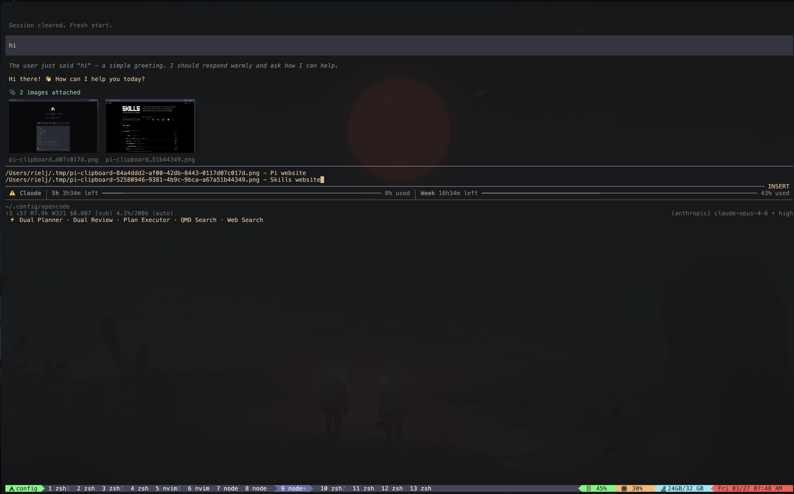

# pi-image-preview

Image preview extension for [pi coding agent](https://github.com/mariozechner/pi-coding-agent) — renders inline image thumbnails above the editor using the kitty graphics protocol with full tmux support.



## Features

- **Inline image preview** — paste an image (`Ctrl+V`) and a thumbnail renders above the editor
- **Horizontal layout** — multiple images display side by side
- **tmux support** — uses kitty's Unicode placeholder protocol (`U=1`) so images are pane-aware (no ghosting across panes)
- **Auto-cleanup** — delete the image path from editor text and the preview disappears
- **No editor conflicts** — works alongside vim mode and other editor extensions (does not use `setEditorComponent`)
- **Image resizing** — leverages pi's built-in WASM image resizer for efficient thumbnails
- **Screenshot integration** — automatically inlines images from screenshot tool results

## Install

```bash
pi install npm:pi-image-preview
```

## How it works

1. **Paste** an image with `Ctrl+V`
2. Pi saves the clipboard to a temp file and inserts the path into the editor
3. The extension **detects the image path**, reads the file, and renders a thumbnail above the editor
4. The raw file path stays in the editor — the label below the thumbnail shows a truncated version
5. On **submit**, image paths are stripped from the text and the images are attached to your message

## Prerequisites

### Terminal: [Kitty](https://sw.kovidgoyal.net/kitty/) (required)

This extension uses the **kitty graphics protocol** to render images. It will **not** render images in other terminals (iTerm2, Alacritty, WezTerm, etc.) — it falls back to text labels instead.

- **Minimum version**: Kitty 0.28+ (Unicode placeholder support)
- **Recommended**: Kitty 0.35+ for best compatibility

No special kitty config is required — the extension works with default kitty settings.

### tmux (optional but supported)

If you run pi inside tmux, you need **one config change** in your `~/.tmux.conf`:

```tmux
set -g allow-passthrough all
```

Then reload: `tmux source-file ~/.tmux.conf`

This allows kitty graphics escape sequences to pass through tmux to the terminal. Without it, images will not render.

**tmux version**: 3.3a+ required (added `allow-passthrough` support).

### pi coding agent

- **Version**: Latest recommended — the extension uses `setWidget`, `getEditorText`, and the `input` event transform API
- **No additional pi configuration needed** — just install the extension

## Supported image formats

- PNG
- JPEG / JPG
- GIF (first frame)
- WebP

Maximum file size: **50 MB** (larger files are silently skipped).

## Limitations

- **Kitty terminal only** — other terminals get text-only labels (no image rendering)
- **macOS / Linux only** — kitty does not run on Windows natively
- **tmux requires `allow-passthrough all`** — without it, images won't render inside tmux (the extension still works, but shows text fallback)
- **No image selection/navigation** — this is a simple preview, not a gallery browser
- **Thumbnail size is fixed** — images are scaled to fit within 25 columns; not configurable yet
- **Images are not preserved in chat history** — after submitting, the preview clears; the image is sent as an attachment to the model
- **GIF animation** — only the first frame is displayed
- **SSH sessions** — kitty graphics protocol does not work over SSH unless using `kitten ssh` (kitty's SSH kitten)
- **Multiple tmux panes showing pi** — each pane renders independently; switching panes clears/restores images correctly via Unicode placeholders, but rapid switching may briefly show artifacts

## How tmux support works

Standard kitty graphics render pixels at absolute terminal positions. This causes images to "ghost" across tmux panes — an image rendered in pane 1 is still visible when you switch to pane 2.

This extension uses kitty's **Unicode placeholder protocol** instead:

1. Image data is transmitted to kitty with `U=1` flag (stored but not directly rendered)
2. Special `U+10EEEE` characters with combining diacritics are output where the image should appear
3. These are **regular text characters** that tmux manages per-pane
4. Switching panes swaps the text buffer → placeholders disappear → image disappears
5. Switching back → placeholders redrawn → image reappears

## Development

```bash
# Clone
git clone https://github.com/rielj/pi-image-preview.git
cd pi-image-preview

# Symlink into pi extensions
ln -s "$(pwd)" ~/.pi/agent/extensions/image-preview

# Reload pi
# Inside pi, run: /reload
```

## License

MIT
